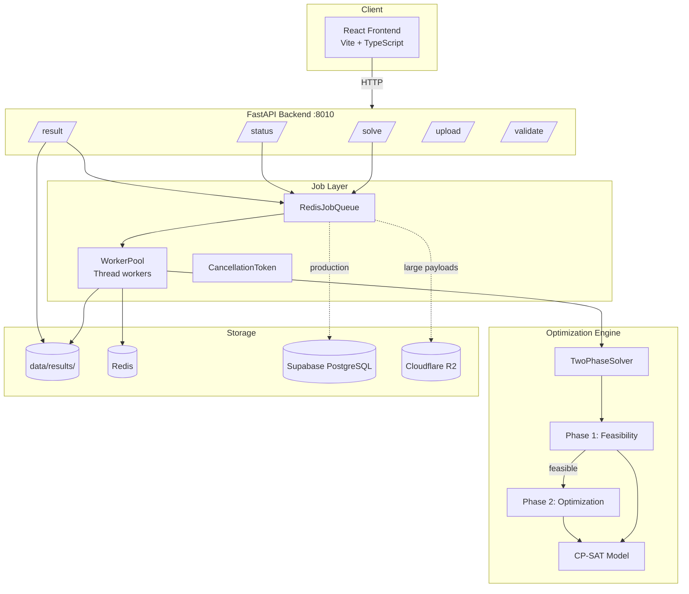
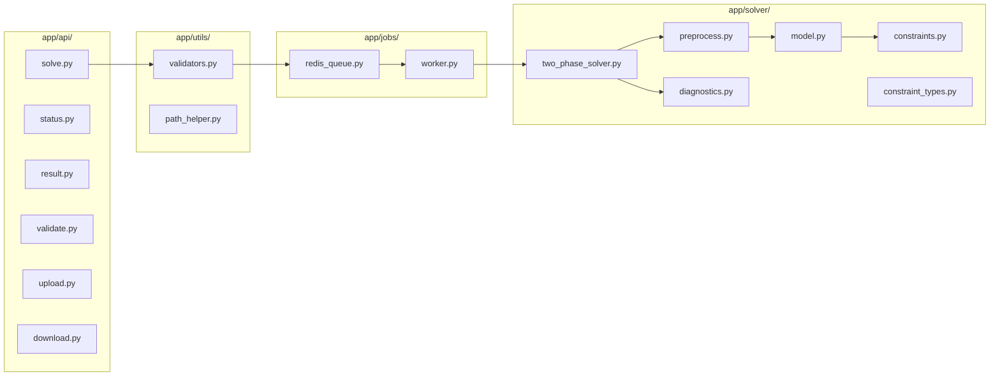
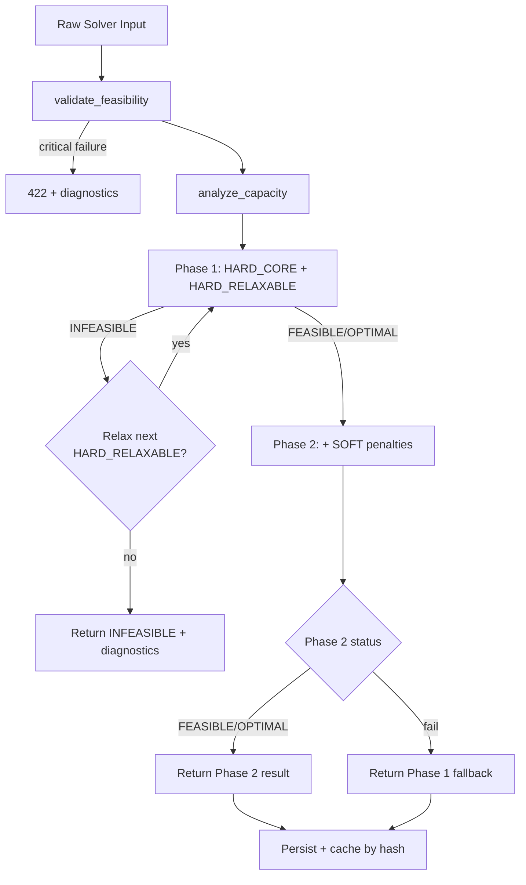
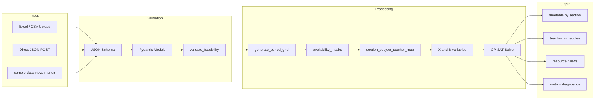
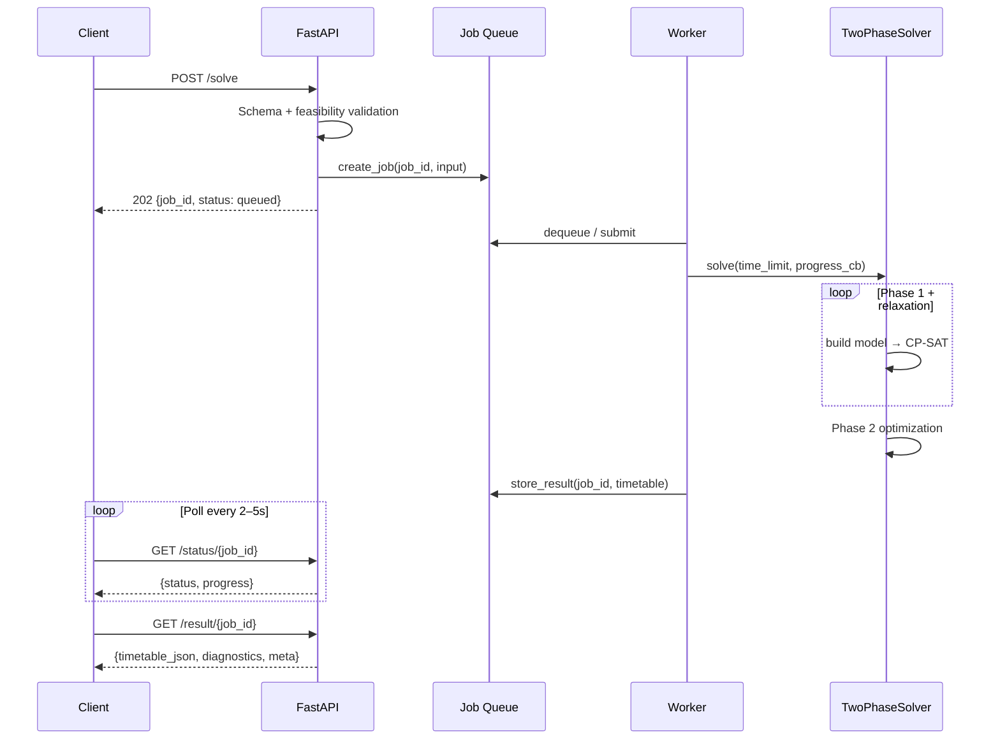
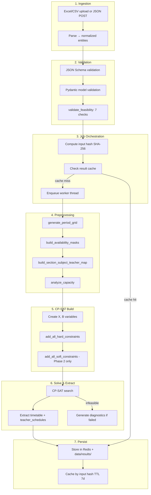
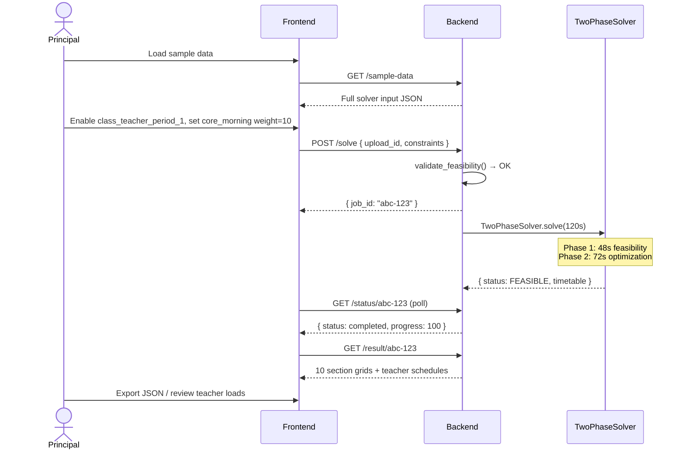

# School Timetable Generator

A production-oriented constraint optimization system that generates conflict-free school timetables using **Google OR-Tools CP-SAT**. The solver models all sections, teachers, subjects, and shared resources in a single global constraint program, then optimizes soft preferences through a two-phase feasibility-first pipeline.

Built for Indian K–12 scheduling realities: language blocks, lab double-periods, substitution reserves, teacher workload caps, and CBSE-style weekly load distributions.

**Deep-dive references:** [info/constraints.txt](info/constraints.txt) · [info/schema.txt](info/schema.txt) · [info/TEACHER_CAPACITY_FORMULA.md](info/TEACHER_CAPACITY_FORMULA.md) · [info/SOLVER_CONFIG.md](info/SOLVER_CONFIG.md) · [CHANGELOG/](CHANGELOG/)

---

## Table of Contents

1. [Executive Overview](#1-executive-overview)
2. [Key Features](#2-key-features)
3. [High-Level Architecture](#3-high-level-architecture)
4. [Optimization Engine](#4-optimization-engine)
5. [Constraint System](#5-constraint-system)
6. [Mathematical Model](#6-mathematical-model)
7. [Project Structure](#7-project-structure)
8. [Technology Stack](#8-technology-stack)
9. [API Reference](#9-api-reference)
10. [Solver Workflow](#10-solver-workflow)
11. [Engineering Challenges](#11-engineering-challenges)
12. [Future Improvements](#12-future-improvements)
13. [Screenshots](#13-screenshots)
14. [Installation](#14-installation)
15. [Local Setup](#15-local-setup)
16. [Usage](#16-usage)
17. [Example Workflow](#17-example-workflow)
18. [Performance Characteristics](#18-performance-characteristics)
19. [Lessons Learned](#19-lessons-learned)
20. [Credits](#20-credits)

---

## 1. Executive Overview

### The Problem

Every academic year, schools must assign thousands of teaching periods across sections, teachers, rooms, and labs while respecting regulatory load limits, teacher availability, and pedagogical preferences. Manual scheduling takes weeks, produces hidden conflicts (double-booked teachers, overloaded labs), and degrades as constraints accumulate.

### Why It Is Computationally Hard

School timetabling is an **NP-hard** combinatorial optimization problem. For a modest school:

| Dimension | Typical Value |
|-----------|---------------|
| Sections | 10–40 |
| Teachers | 35–60 |
| Subjects | 12–20 |
| Academic periods / section / week | ~40–45 |
| Decision points per section-slot | One of ~12 subjects or FREE |

A single section with 40 slots and 12 subjects has \(12^{40} \approx 10^{43}\) naive assignments. Multiply by cross-section teacher coupling, resource capacity, and block contiguity — brute force is impossible.

### Why CP-SAT

[CP-SAT](https://developers.google.com/optimization/cp/cp_solver) (Constraint Programming + SAT-based search) was chosen because:

| Requirement | CP-SAT Fit |
|-------------|------------|
| Hard feasibility (no double-booking) | Native Boolean variables + linear constraints |
| Soft preferences (morning core subjects) | Penalty variables in weighted objective |
| Partial solutions under time pressure | Returns FEASIBLE before proving OPTIMAL |
| Industrial scale | Parallel search (`num_search_workers`), presolve, LNS |
| Integrability | Pure Python via `ortools`, no external solver license |

Alternatives considered and rejected: greedy heuristics (fast but infeasible under tight staffing), MIP with continuous relaxations (poor fit for all-or-nothing assignments), per-class decomposition (misses global teacher conflicts).

### Real-World Motivation

This system targets **SchoolOS**-style deployments: principals upload staffing spreadsheets, configure constraint toggles, and receive a validated timetable in under two minutes. The bundled **Vidya Mandir** dataset (10 sections, 35 teachers, 12 subjects, 4 shared resources) reflects a realistic CBSE/ICSE middle-school configuration with language triplets and lab blocks.

---

## 2. Key Features

| Feature | Implementation |
|---------|----------------|
| **Production-grade architecture** | FastAPI async API, Redis job queue with in-memory fallback, dual persistence (Redis + filesystem), optional Supabase/R2/Sentry |
| **Constraint optimization** | OR-Tools CP-SAT with presolve, probing, optional variables, core-based optimization |
| **Conflict-free scheduling** | Global single-model solve — all sections simultaneously |
| **Configurable hard & soft constraints** | Three-tier registry (`HARD_CORE`, `HARD_RELAXABLE`, `SOFT`) with API toggles and weight sliders |
| **Teacher workload balancing** | Daily min/max, weekly balance variance, consecutive period caps, gap minimization |
| **Resource scheduling** | Simultaneous capacity per resource type (labs, grounds) |
| **Language synchronization** | Language teacher set detection; strict simultaneous sync deferred (see §5) |
| **Multi-section scheduling** | One CP model covers every section in the input |
| **Validation pipeline** | JSON Schema → Pydantic → `validate_feasibility()` pre-flight → post-solve diagnostics |
| **JSON schema validation** | Shared schemas in `shared/schemas/` consumed by backend and frontend (Zod) |
| **Configurable solver** | Time limits, demo/production modes, deadline scheduling, hash-based cache invalidation |

---

## 3. High-Level Architecture

### Complete System Architecture



### Backend Architecture



### Solver Pipeline



### Data Flow



### Request Lifecycle



---

## 4. Optimization Engine

### Decision Variables

| Variable | Domain | Semantics |
|----------|--------|-----------|
| \(X_{s,d,p,j}\) | \(\{0,1\}\) | Section \(s\) has subject \(j\) in day \(d\), period \(p\) |
| \(B_{s,j,d,p}\) | \(\{0,1\}\) | A contiguous block for subject \(j\) in section \(s\) **starts** at \((d,p)\) |

Subject–teacher pairings are **fixed** via `subject_teacher_map` (data, not decision variables). Prayer (Period 0), recess, and lunch are excluded from academic scheduling via `get_academic_periods()`.

### Constraint Satisfaction

Hard constraints are posted as linear (in)equalities over Boolean sums. CP-SAT's presolve propagates domains and detects infeasibility early. Soft constraints use integer penalty slack variables bounded and added to the objective.

### Objective Function

\[
\min \sum_{k \in \text{soft}} w_k \cdot \text{penalty}_k
\]

Phase 1 sets `_phase1_only=True` — objective is empty; the solver seeks **any** feasible assignment. Phase 2 minimizes the weighted penalty sum.

### Hard Constraints

See [§5](#5-constraint-system) for the full catalog. Tier summary:

| Tier | Count | Behavior |
|------|-------|----------|
| `HARD_CORE` | 5 | Never relaxed |
| `HARD_RELAXABLE` | 8 | Auto-relaxed in priority order during Phase 1 |

### Soft Constraints

Nine implemented soft penalties (weights configurable via `constraints.soft_weights`). Phase 1 excludes all soft constraints.

### Search Strategy

Configured in `TimetableSolver.solve()`:

| Parameter | Value | Purpose |
|-----------|-------|---------|
| `num_search_workers` | 8 (default) | Parallel portfolio search |
| `cp_model_presolve` | true | Domain reduction before search |
| `cp_model_probing_level` | 2 | Aggressive probing |
| `linearization_level` | 2 | Stronger LP relaxations |
| `optimize_with_core` | true | Core-guided optimization for soft penalties |
| `interleave_search` | true if time > 60s | Diversify search threads |
| `diversify_lns_params` | true if time > 60s | Large Neighborhood Search diversity |

### CP-SAT Optimization

The two-phase design separates **feasibility** from **quality**:

1. **Phase 1 (40% time budget, min 15s):** Find a valid timetable; relax `HARD_RELAXABLE` constraints one at a time if infeasible.
2. **Phase 2 (60% time budget, min 15s):** Rebuild model with soft penalties; return Phase 2 if successful, else Phase 1 fallback.

### Why Brute Force Fails

For the Vidya Mandir dataset:

- 10 sections × ~40 academic slots = **400 section-periods** to fill
- Each slot: choose among ~12 subjects (or FREE) → \(13^{400}\) combinations
- Cross-cutting teacher uniqueness couples all sections — independent per-section enumeration misses global conflicts
- Even at 1 billion assignments/second, exhaustive search exceeds the age of the universe

CP-SAT prunes the search tree via constraint propagation, conflict learning, and parallel heuristics — exploring only viable branches.

---

## 5. Constraint System

Constraints are registered in `server/app/solver/constraint_types.py` and implemented in `constraints.py`. Full pedagogical rationale is in [info/constraints.txt](info/constraints.txt).

### HARD_CORE — Never Relaxed

#### Teacher Conflicts (`teacher_single_assignment`)

A teacher cannot teach two sections simultaneously.

**Example:** If T001 teaches Math in 8A on Monday P3, then \(X_{8A,Mon,3,MATH}=1\) implies no other section assigned to T001 at that slot.

\[
\sum_{(s,j) \in \text{assignments}(t)} X_{s,d,p,j} \leq 1 \quad \forall\, t,d,p
\]

#### Section Single Subject (`section_single_subject`)

At most one subject per section per period.

**Example:** 6A cannot have both Science and English in Tuesday P5.

\[
\sum_{j} X_{s,d,p,j} \leq 1 \quad \forall\, s,d,p
\]

#### Subject Allocation / Weekly Load (`subject_frequency`)

Each subject must receive between `min_per_week` and `max_per_week` periods per section.

**Example:** Math requires 6 periods/week in 9A → exactly 6 slots assigned across Mon–Sat.

\[
\text{min}_j \leq \sum_{d,p} X_{s,d,p,j} \leq \text{max}_j
\]

#### Teacher Availability (`teacher_availability`)

Unavailable slots are forced to zero for that teacher's assignments.

**Example:** T025 (PE) blocked on Saturday → no PE slot in any section on Sat.

#### Resource Allocation (`resource_capacity`)

Subjects requiring a resource type cannot exceed simultaneous capacity.

**Example:** 2 computer labs → at most 2 sections have Computer scheduled at Monday P6.

\[
\sum_{s: j \text{ uses } r} X_{s,d,p,j} \leq \text{capacity}_r
\]

---

### HARD_RELAXABLE — Relaxed in Priority Order

| Priority | Constraint | Example |
|----------|------------|---------|
| 1 | `language_sync` | Hindi/Kannada/Sanskrit teachers aligned across shared sections |
| 2 | `class_teacher_period_1` | Class teacher of 7B teaches 7B in Period 1 |
| 3 | `no_subject_twice_daily` | Math appears at most once per day in 8A (blocks exempt) |
| 4 | `substitution_reserve` | ≥3 teachers free every period for absentee cover |
| 5 | `max_consecutive` | No teacher teaches more than 3 consecutive periods |
| 6 | `teacher_daily_load` | Daily periods within `[min_periods_day, max_periods_day]` |
| 7 | `teacher_weekly_balance` | Daily load variance ≤ `max_daily_load_variance` (default 3) |
| 8 | `block_periods` | Lab subjects get contiguous double-periods without bridging lunch |

#### Weekly Load (`teacher_daily_load` + `subject_frequency`)

Combines per-teacher daily caps with per-subject weekly totals. Period 0 (assembly) is excluded from teacher load counts.

#### Consecutive Periods (`max_consecutive`)

Sliding window of size `max_consecutive + 1` over academic periods; sum of teaching assignments ≤ `max_consecutive`. Skips windows spanning recess/lunch.

**Example:** With `max_consecutive=3`, a teacher cannot teach P2–P6 without a break if P4 is lunch.

#### Labs (`block_periods`)

Uses \(B_{s,j,d,p}\) start variables to enforce contiguous `block_length` periods. Blocks cannot span recess or lunch gaps.

**Example:** Physics lab (`requires_block=true`, `block_length=2`) occupies Tue P7–P8 consecutively.

#### Language Synchronization (`language_sync`)

**Design intent:** When section 8A runs a language block, Hindi/Kannada/Sanskrit teachers for that section should be simultaneously schedulable so students split into language groups.

**Current implementation:** The strict CP constraint was removed after proving infeasible for typical staffing ratios. The function detects language teacher sets and logs them; feasibility relies on teacher single-assignment + subject frequency + soft balancing. Enabling this toggle participates in the relaxation loop but adds no additional CP constraints. See [info/TEACHER_CAPACITY_FORMULA.md](info/TEACHER_CAPACITY_FORMULA.md) for staffing math.

#### Class Teacher Constraints (`class_teacher_period_1`)

When enabled, the class teacher must teach their section in Period 1 each day they appear on the timetable.

#### Core Subject Prioritization

Implemented as a **soft** constraint (`core_morning`), not hard — see below.

#### Student Fatigue (Soft)

Pedagogical energy management for students:

| Soft Constraint | Mechanism |
|-----------------|-----------|
| `leisure_afternoon` | Penalize PE/Art/Music in periods 1–3 |
| `avoid_pe_period_1` | Penalize PE in Period 1 or after lunch |
| `subject_distribution` | Penalize >2 core-subject periods same day (min≥5 subjects) |

**Example:** PE in Monday P1 incurs penalty \(w_{\text{pe}} \times 1\); solver prefers afternoon PE.

#### Teacher Fatigue (Hard + Soft)

| Constraint | Tier | Mechanism |
|------------|------|-----------|
| `max_consecutive` | HARD_RELAXABLE | Cap back-to-back teaching |
| `teacher_daily_load` | HARD_RELAXABLE | Daily min/max periods |
| `teacher_weekly_balance` | HARD_RELAXABLE | Limit day-to-day load swings |
| `teacher_balance` | SOFT | Minimize variance in daily loads |
| `minimize_gaps` | SOFT | Reduce idle gaps between classes |
| `teacher_free_period` | SOFT | Prefer at least one free period/day |

**Example:** A teacher with 7 periods Monday and 2 Tuesday violates `teacher_weekly_balance` (variance > 3) unless relaxed.

#### Additional Soft Constraints

| Name | Default Weight | Purpose |
|------|----------------|---------|
| `core_morning` | 3 | Core subjects before lunch |
| `fair_slot_distribution` | 5 | Rotate undesirable slots (last period, Saturday) |
| `specialist_priority` | 8 | Prioritize specialist teachers for their subjects |

---

## 6. Mathematical Model

### Sets and Indices

| Symbol | Definition |
|--------|------------|
| \(S\) | Sections (classes) |
| \(T\) | Teachers |
| \(J\) | Subjects |
| \(D\) | Weekdays |
| \(P_d\) | Academic periods on day \(d\) |
| \(\sigma(s,j)\) | Fixed teacher for subject \(j\) in section \(s\) |

### Decision Variables

\[
X_{s,d,p,j} \in \{0,1\}, \quad B_{s,j,d,p} \in \{0,1\}
\]

### Hard Constraints (Summary)

| Constraint | Formulation |
|------------|-------------|
| Section occupancy | \(\sum_j X_{s,d,p,j} \leq 1\) |
| Teacher uniqueness | \(\sum_{s,j: \sigma(s,j)=t} X_{s,d,p,j} \leq 1\) |
| Subject frequency | \(\text{min}_j \leq \sum_{d,p} X_{s,d,p,j} \leq \text{max}_j\) |
| Availability | \(X_{s,d,p,j} = 0\) if \(\sigma(s,j)\) unavailable at \((d,p)\) |
| Resource capacity | \(\sum_{s} X_{s,d,p,j} \leq C_r\) for resource type \(r\) |
| Max consecutive | \(\sum_{p' \in W} X_{s,d,p',j} \leq k\) for window \(W\) of size \(k+1\) |
| Weekly balance | \(\max_d L_{t,d} - \min_d L_{t,d} \leq V\) where \(L_{t,d} = \sum_{s,p} X_{s,d,p,\cdot}\) |
| Substitution reserve | \(\sum_t \text{assigned}_{t,d,p} \leq \|T\| - R\) |
| Block contiguity | \(B_{s,j,d,p} \Rightarrow \bigwedge_{k=0}^{L-1} X_{s,d,p+k,j}\) |

### Soft Objective

For each soft rule \(k\), introduce penalty \(p_k \geq 0\) with:

\[
p_k \geq \text{violation\_indicator}_k, \quad \min \sum_k w_k \cdot p_k
\]

### Capacity Feasibility (Pre-Solve)

From [info/TEACHER_CAPACITY_FORMULA.md](info/TEACHER_CAPACITY_FORMULA.md):

\[
\text{Capacity Ratio} = \frac{\sum_{t \in T} \text{max\_periods\_week}(t)}{\sum_{s \in S} |\text{academic slots}(s)|}
\]

- Ratio \(\geq 1.2\) — comfortable staffing
- Ratio \(\geq 1.0\) — tight but feasible
- Ratio \(< 1.0\) — likely infeasible without staffing changes

Minimum teachers per subject:

\[
T_{\min}(j) = \left\lceil \frac{|S| \times p_j}{T_{\max}} \right\rceil
\]

---

## 7. Project Structure

```
timetable-generator/
├── server/                      # Python backend
│   ├── app/
│   │   ├── main.py              # FastAPI app, CORS, lifespan, /health
│   │   ├── config.py            # Env-based config, paths, solver tuning
│   │   ├── api/                 # REST endpoints
│   │   │   ├── solve.py         # Job submission
│   │   │   ├── status.py        # Progress polling, cancel
│   │   │   ├── result.py        # Timetable retrieval
│   │   │   ├── validate.py      # Manual swap validation
│   │   │   ├── upload.py        # CSV/Excel parsing
│   │   │   └── download.py      # Templates, sample data
│   │   ├── solver/              # CP-SAT optimization engine
│   │   │   ├── two_phase_solver.py
│   │   │   ├── model.py
│   │   │   ├── constraints.py
│   │   │   ├── constraint_types.py
│   │   │   ├── preprocess.py
│   │   │   ├── diagnostics.py
│   │   │   └── tests/
│   │   ├── jobs/                # Async execution
│   │   │   ├── redis_queue.py
│   │   │   ├── worker.py
│   │   │   └── queue.py         # Legacy in-memory queue
│   │   ├── parsers/             # Excel/CSV → JSON
│   │   └── utils/               # Validators, R2, Supabase, Redis semaphore
│   ├── migrations/              # Supabase jobs table SQL
│   └── requirements.txt
├── frontend/                    # React SPA
│   └── src/
│       ├── pages/               # Upload, Constraints, Generate, Results
│       ├── components/          # TimetableGrid, UI primitives (shadcn/Radix)
│       ├── lib/                 # API client, Zod schemas
│       ├── stores/              # Zustand (persisted job state)
│       └── mocks/               # MSW handlers for offline dev
├── shared/schemas/              # Canonical JSON Schema contracts
├── info/                        # Architecture & formula documentation
├── CHANGELOG/                   # Implementation history
├── tools/                       # verify_demo_case.sh acceptance test
├── data/                        # Runtime: uploads, parsed, results
└── docs/screenshots/            # UI screenshots (add assets here)
```

---

## 8. Technology Stack

### Backend

| Technology | Version | Role |
|------------|---------|------|
| Python | 3.10+ | Runtime |
| FastAPI | ≥0.104 | Async REST API |
| Uvicorn | ≥0.24 | ASGI server |
| Google OR-Tools | ≥9.8 | CP-SAT solver |
| Pydantic | ≥2.5 | Request validation |
| jsonschema | ≥4.20 | Shared schema validation |
| Redis | ≥5.0 | Job queue, cache, cancellation |
| Supabase | ≥2.3 | PostgreSQL job persistence (production) |
| boto3 | ≥1.34 | Cloudflare R2 object storage |
| openpyxl | ≥3.1 | Excel template parsing |
| Sentry SDK | ≥1.40 | Error tracking (optional) |
| pytest | ≥7.4 | Solver unit tests |

### Frontend

| Technology | Version | Role |
|------------|---------|------|
| React | 18.3 | UI framework |
| TypeScript | 5.6 | Type safety |
| Vite | 5.4 | Build tool, dev server |
| TanStack Query | 5.59 | Server state, polling |
| Zustand | 5.0 | Client state (persisted) |
| Zod | 3.23 | Runtime validation |
| Radix UI + Tailwind | — | Accessible components |
| Axios | 1.7 | HTTP client |
| MSW | 2.4 | API mocking |
| Vitest | 2.1 | Unit tests |
| Playwright | 1.58 | E2E tests |

### Infrastructure (Production-Ready)

| Service | Purpose |
|---------|---------|
| Supabase PostgreSQL | Job records, audit trail, multi-tenant RLS |
| Cloudflare R2 | Large solver inputs and result payloads |
| Redis / Upstash | Distributed queue, semaphores, pub/sub status |
| Sentry | Observability |

---

## 9. API Reference

Base path: `/api/v1/timetable` · Default port: **8010** · OpenAPI: `/docs`

### Core Endpoints

| Method | Path | Description |
|--------|------|-------------|
| `GET` | `/` | API metadata and endpoint map |
| `GET` | `/health` | Health check |
| `GET` | `/api/v1/timetable/config` | Solver timeouts, queue limits, feature flags |

### Solve & Jobs

| Method | Path | Request Body | Response |
|--------|------|--------------|----------|
| `POST` | `/solve` | `SolveRequest`: direct input **or** `upload_id` + optional `constraints`, `options` | `{ job_id, status, time_allocated_seconds, estimated_completion }` |
| `GET` | `/status/{job_id}` | Query: `include_logs` | `{ job_id, status, progress, timestamps, error?, logs? }` |
| `POST` | `/cancel/{job_id}` | — | `{ job_id, cancelled, message }` |
| `GET` | `/jobs` | Query: `limit`, `status?` | `{ jobs[], total, active_workers }` |

**Solve options:**

```json
{
  "options": {
    "time_limit_seconds": 120,
    "demo_mode": true,
    "deadline": "2026-07-01T15:00:00Z",
    "force_fresh": true,
    "strategy": "balanced"
  }
}
```

> `strategy` is accepted but not yet wired to solver behavior.

### Results

| Method | Path | Description |
|--------|------|-------------|
| `GET` | `/result/{job_id}` | Timetable JSON wrapper; `format=file` for download |
| `GET` | `/result/{job_id}/full` | Complete persisted job record |
| `GET` | `/result/{job_id}/diagnostics` | Diagnostics and warnings only |
| `GET` | `/result/{job_id}/section/{section_id}` | Single section timetable |
| `GET` | `/result/{job_id}/teacher/{teacher_id}` | Single teacher schedule |

### Validation

| Method | Path | Description |
|--------|------|-------------|
| `POST` | `/validate` | Validate period block swap (teacher clash, availability) |
| `POST` | `/validate/modification` | Validate single-cell subject/teacher change |

Requires job result in memory (post-restart validation needs re-solve).

### Upload & Templates

| Method | Path | Description |
|--------|------|-------------|
| `POST` | `/upload` | Multipart CSV/Excel upload with `data_type` |
| `GET` | `/templates/{data_type}` | CSV column headers and example row |
| `GET` | `/download-template` | Excel workbook template |
| `GET` | `/download-sample` | Vidya Mandir sample Excel |
| `GET` | `/sample-data` | Full sample JSON (`upload_id: sample-data-vidya-mandir`) |

> `upload_id` references in `/solve` currently resolve only `sample-data*` identifiers. Parsed upload files are stored but not yet linked to solve by `file_id`.

---

## 10. Solver Workflow

End-to-end pipeline from input to timetable:



### Pre-Flight Feasibility Checks (`validate_feasibility`)

1. Section minimum periods vs available academic slots
2. Teacher weekly capacity vs assigned minimum load
3. Block subjects fit in consecutive unbroken day segments
4. Resource weekly demand vs capacity × slots
5. Substitution reserve vs teacher count
6. Class teacher ID validity
7. Subject–teacher lock-in (teacher exists and is qualified)

---

## 11. Engineering Challenges

### NP-Hard Scheduling

The problem generalizes graph coloring and bin packing. No polynomial-time exact algorithm is known. CP-SAT trades optimality guarantees for bounded-time feasible solutions.

### Constraint Explosion

A school with 40 sections, 60 teachers, 12 subjects, and 6 days × 8 periods produces:

- ~19,200 primary \(X\) variables
- Thousands of linear constraints from teacher coupling alone

Variable and constraint counts are returned in `meta.variables_count` and `meta.constraints_count`.

### Search Space Reduction

Techniques applied:

| Technique | Where |
|-----------|-------|
| Fixed subject–teacher mapping | Eliminates teacher-assignment variables |
| Academic period filtering | Excludes prayer/break slots from model |
| Presolve + probing | OR-Tools automatic domain reduction |
| Two-phase decomposition | Feasibility before expensive soft optimization |
| Ordered relaxation | Drop least-critical hard rules first |
| Input hash caching | Skip re-solve for identical payloads |

### Optimization Techniques

- Parallel portfolio search (8 workers)
- Core-guided optimization for soft penalties
- Large Neighborhood Search diversification for long runs
- Capacity ratio pre-check avoids doomed solves

### Scalability

| Scale | Expected Behavior |
|-------|-------------------|
| 10 sections, 35 teachers | Solves in <120s with default constraints |
| 40 sections, 60 teachers | May require 300–1800s; relaxation likely |
| 40+ sections | Single monolithic model; no grade-level decomposition yet |

Production concurrency: `MAX_CONCURRENT_JOBS=5`, `MAX_GLOBAL_ACTIVE_SOLVES=6`, `MAX_PER_TENANT_ACTIVE=1` with Redis semaphores.

---

## 12. Future Improvements

| Area | Planned Enhancement |
|------|---------------------|
| **Warm-start hints** | Feed Phase 1 solution into Phase 2 via CP-SAT hints (field exists, not consumed) |
| **Language sync CP model** | Feasible relaxed formulation for triplet synchronization |
| **Upload → solve linking** | Resolve `upload_id` to parsed files from `/upload` |
| **`options.strategy`** | Wire `feasibility` / `balanced` / `optimize` to phase time budgets |
| **Grade decomposition** | Partition very large schools with cross-grade teacher locking |
| **Manual edit UI** | Drag-and-drop swaps with live `/validate` feedback |
| **Constraint presets** | Save/load configuration profiles per school |
| **Versioning & audit** | Timetable revision history with diff |
| **Distributed solving** | Horizontal worker scaling with Redis queue |
| **Golden test suite** | Regression fixtures for each constraint in isolation |

---

## 13. Screenshots

Add UI captures to `docs/screenshots/` and reference them here:

| View | File | Description |
|------|------|-------------|
| Landing | `docs/screenshots/landing.png` | Three-step workflow overview |
| Upload | `docs/screenshots/upload.png` | Drag-and-drop Excel/CSV ingest |
| Constraints | `docs/screenshots/constraints.png` | Hard toggles and soft weight sliders |
| Generate | `docs/screenshots/generate.png` | Job progress polling |
| Results — Class | `docs/screenshots/results-class.png` | Section timetable grid |
| Results — Teacher | `docs/screenshots/results-teacher.png` | Teacher schedule view |

Run the frontend locally (`npm run dev` → http://localhost:3000) to capture screenshots from the Vidya Mandir sample dataset.

---

## 14. Installation

### Prerequisites

- Python 3.10+
- Node.js 18+
- (Optional) Redis for production queue semantics

### Backend

```bash
cd server
python -m venv venv
source venv/bin/activate          # Windows: venv\Scripts\activate
pip install -r requirements.txt
```

### Frontend

```bash
cd frontend
npm install
```

---

## 15. Local Setup

### Environment Variables

Copy examples and configure as needed:

```bash
cp server/.env.example server/.env
cp frontend/.env.example frontend/.env
```

| Variable | Default | Description |
|----------|---------|-------------|
| `SERVER_PORT` | `8010` | API port |
| `DEMO_MODE` | `true` | Immediate job allocation |
| `DEMO_SOLVE_TIME_SEC` | `120` | Demo solve time budget |
| `DEFAULT_SOLVE_TIME_SEC` | `90` | Production default |
| `MAX_SOLVE_TIME_SEC` | `1800` | Hard cap (30 min) |
| `CP_SAT_SEARCH_WORKERS` | `8` | Parallel search threads |
| `SOLVER_VERSION` | `2.0.0` | Cache invalidation key |
| `REDIS_URL` | — | Enables Redis queue (falls back to in-memory) |
| `SUPABASE_URL` / `SUPABASE_KEY` | — | Production job persistence |
| `R2_*` | — | Object storage for large payloads |
| `VITE_API_URL` | `http://localhost:8010` | Frontend API target |

Full configuration reference: [info/SOLVER_CONFIG.md](info/SOLVER_CONFIG.md)

### Start Services

```bash
# Terminal 1 — Backend
cd server && source venv/bin/activate
python -m app.main
# API: http://localhost:8010/docs

# Terminal 2 — Frontend
cd frontend && npm run dev
# UI: http://localhost:3000
```

---

## 16. Usage

### Via UI

1. Open http://localhost:3000
2. **Upload** — use sample data or upload Excel template
3. **Constraints** — toggle hard rules, adjust soft weights
4. **Generate** — submit job, monitor progress
5. **Results** — view class/teacher grids, export JSON

### Via API

```bash
# Submit solve with bundled sample data
curl -X POST http://localhost:8010/api/v1/timetable/solve \
  -H "Content-Type: application/json" \
  -d '{
    "upload_id": "sample-data-vidya-mandir",
    "options": { "time_limit_seconds": 120, "force_fresh": true }
  }'

# Poll status
curl http://localhost:8010/api/v1/timetable/status/{job_id}

# Fetch result
curl http://localhost:8010/api/v1/timetable/result/{job_id}
```

### Acceptance Test

```bash
SERVER_URL=http://localhost:8010 ./tools/verify_demo_case.sh --verbose
```

---

## 17. Example Workflow

**Scenario:** Generate a timetable for Vidya Mandir (10 sections, 35 teachers).



**Expected outcome:** `status` of `FEASIBLE` or `OPTIMAL`, 10 section timetables, `meta.solve_time_seconds` under 120s for default constraints, `relaxation_info.relaxed_constraints` empty if staffing is sufficient.

---

## 18. Performance Characteristics

| Metric | Value | Source |
|--------|-------|--------|
| Default solve timeout | 120s (demo), 90s (production) | `config.py` |
| Maximum solve timeout | 1800s (30 min) | `MAX_SOLVE_TIME_SEC` |
| Phase 1 / Phase 2 split | 40% / 60% (min 15s each) | `two_phase_solver.py` |
| CP-SAT workers | 8 | `CP_SAT_SEARCH_WORKERS` |
| Max concurrent jobs | 5 | `MAX_CONCURRENT_JOBS` |
| Cache TTL | 7 days (hash), 30 days (results) | `redis_queue.py` |
| Upload sync limit | 1 MB | `PARSE_SYNC_MAX_SIZE` |

### Model Scale (Vidya Mandir)

| Entity | Count |
|--------|-------|
| Sections | 10 |
| Teachers | 35 |
| Subjects | 12 |
| Resources | 4 |
| Academic periods / section / week | ~40 |

### Solver Outcomes

| Status | Meaning |
|--------|---------|
| `OPTIMAL` | Best solution proven within time limit |
| `FEASIBLE` | Valid timetable; optimality not proven |
| `INFEASIBLE` | No assignment satisfies hard constraints |
| `TIMEOUT` | Time exhausted before feasibility proof |
| `CANCELLED` | User cancelled via `/cancel` |

### Capacity Thresholds

| Ratio | Interpretation |
|-------|----------------|
| ≥ 1.2 | Comfortable — solver should succeed quickly |
| ≥ 1.0 | Tight — relaxation may be needed |
| < 1.0 | Insufficient staffing — pre-flight warnings |

---

## 19. Lessons Learned

1. **Feasibility before optimality.** Principals need a valid timetable now, not a perfect one never delivered. The two-phase pipeline with ordered relaxation operationalizes this.

2. **Not every documented constraint belongs in the CP model.** Strict language-block synchronization is mathematically incompatible with typical 1.5:1 teacher:section ratios. Detecting teacher sets and deferring to soft balancing was the correct engineering trade-off.

3. **Schema-first contracts prevent integration drift.** Shared JSON Schemas consumed by Python (`jsonschema`), TypeScript (Zod), and documentation eliminate an entire class of frontend/backend mismatches.

4. **Global solve is non-negotiable for teacher coupling.** Per-class solvers produce locally optimal, globally invalid schedules.

5. **Cache invalidation must include solver version.** Hashing input + `SOLVER_VERSION` prevents stale results after constraint logic changes.

6. **Pre-flight feasibility saves CPU.** Seven structural checks before CP-SAT catch overloaded teachers and impossible lab blocks in milliseconds.

7. **Dual persistence (Redis + filesystem) survives restarts.** Job metadata in Redis; canonical results in `data/results/` for fallback retrieval.

8. **Honest diagnostics build trust.** When infeasible, structured `diagnostics` with `suggestions` (relax X, hire Y teachers) are more valuable than a generic failure message.

---

## 20. Credits

| Component | Attribution |
|-----------|-------------|
| CP-SAT Solver | [Google OR-Tools](https://developers.google.com/optimization) |
| Web Framework | [FastAPI](https://fastapi.tiangolo.com/) |
| UI Components | [Radix UI](https://www.radix-ui.com/) + [shadcn/ui](https://ui.shadcn.com/) patterns |
| Sample Dataset | Vidya Mandir fictional school (CBSE-style configuration) |

**Author:** Abhishek L Gowda

**License:** See repository license file.

---

## Known Implementation Notes

Documented honestly for reviewers:

| Item | Status |
|------|--------|
| `language_sync` CP constraint | Detection/logging only; strict sync removed as infeasible |
| `warm_start` in Phase 2 | Passed in input; not yet applied in `model.py` |
| `options.strategy` | Request field only |
| `upload_id` beyond sample data | Not linked to `/upload` parsed files |
| `avoid_pe_after_lunch` in schema | Not implemented in `constraints.py` |
| Manual validate endpoints | Require in-memory job (no disk reload) |

For implementation history, see [CHANGELOG/two_phase_solver_implementation.md](CHANGELOG/two_phase_solver_implementation.md) and [CHANGELOG/changes_explained.md](CHANGELOG/changes_explained.md).
